# Setting up the Virtual Machine Environment

* Download and install VirtualBox on your machine: http://virtualbox.org/wiki/Downloads
* Download the Cloudera Quickstart VM at http://www.cloudera.com/content/cloudera/en/downloads/quickstart_vms/cdh-5-3-x.html.
* Uncompress the VM archive. It is compressed with 7-zip. If needed you can download a tool to uncompress the archive at http://www.7-zip.org/.
* Install the VM in VirtualBox.
    * Start *VirtualBox* and click *Import Appliance* in the *File* dropdown menu. 
    * Click the folder icon beside the location field. 
    * Browse to the uncompressed archive folder, select the `.ovf` file, and click the *Open* button. 
    * Click the *Continue* button. 
    * Click the *Import* button.
* Your virtual machine should now appear in the left column. Select it and click on *Start* to launch it.
* To verify that the VM is running and you can access it, open a browser *on your host machine* to the URL [http://localhost:8088](http://localhost:8088). You should see the resource manager UI. The VM uses port forwarding for the common Hadoop ports, so when the VM is running, those ports on localhost will redirect to the VM.
* The virtual machine is equipped with the software:
    * Linux Distro CentOS 6.4
    * Java Environment JDK 7 (1.7.0_67)
    * Hadoop 2.5.0
    * Eclipse 4.2.6 (Juno)
* If, for any reason, you need the account information for the VM, the username is `cloudera` and the password is `cloudera`.

* **The virtual machine runs best with 4096 MB of RAM**, but has been tested to function with 1024 MB. Note that *at 1024 MB, while it did technically function, it was very slow to start up*.

# Hadoop Programming in Eclipse

In this section you will create a new Eclipse Hadoop project, compile, and execute it. The program will count the frequency of all the words in a given large text file. In your virtual machine, Hadoop, Java environment and Eclipse have already been pre-installed.

Creating a program in Eclipse requires several steps: create a project, setting up the build path with the required JAR files, write down the code of the program, compile, execute, test and debug it and finally create a JAR file.

The VM is pre-installed with all necessary tools and software to reduce to minimum the effort to start writing Hadoop programs. 

## How to create a Hadoop project

1. Open *Eclipse*. If you just launched the VM, you may have to close the *Firefox* window to find the *Eclipse* icon on the desktop.
2. Right-click on the *training* node in the *Package Explorer* and select *Copy*.

    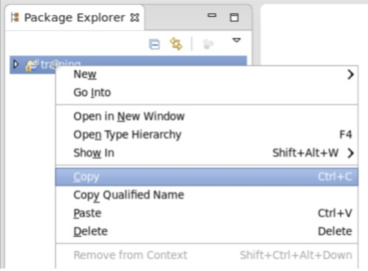
3. The *training* node represents an existing Eclipse project preconfigured with a set of 4 dummy Java source files in the default namespace that we will not use. However, it includes the correct build bath to include the JAR files required for Hadoop.
4. Right-click on the *training* node in the *Package Explorer* and select *Paste*.

    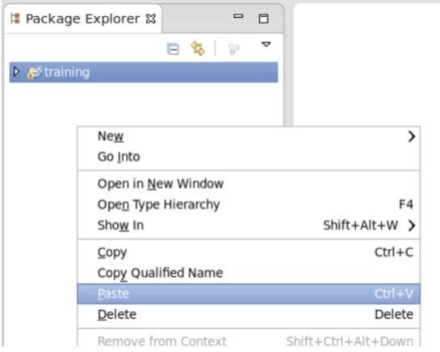
5. In the pop-up dialog, enter the new project name in the *Project Name* field and click *OK* (e.g., `WordCount`).

    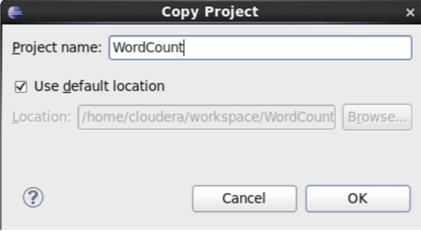
    
## How to write a Hadoop program 

The steps required to write a Hadoop program are almost always the same. The compilation process is carried out automatically by Eclipse in background, and errors will be highlighted with red marks and icons, together with possible solutions.

1. Create a new package called `it.cnr.isti.pad.wordcount` by right-clicking on the `src` node and selecting *New* → *Package*.
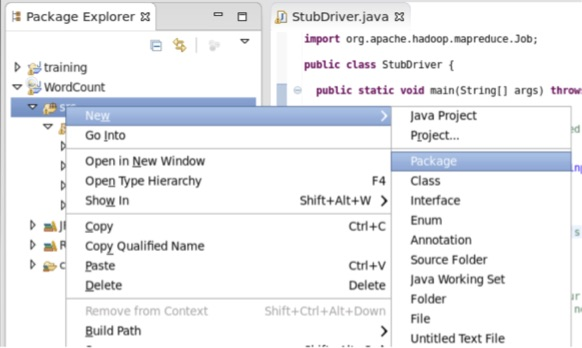
2. Enter `it.cnr.isti.pad.wordcount` in the *Name* field and click *Finish*.
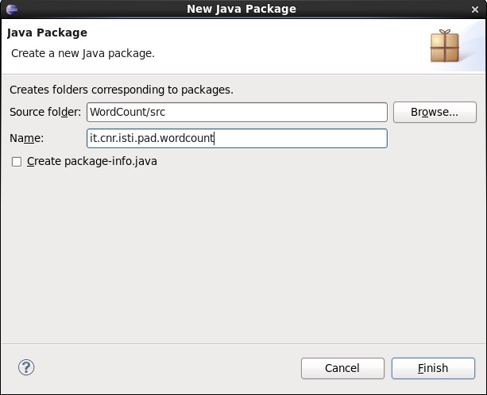
3. Create a new class in that package called `WordCount` by right-clicking on the `it.cnr.isti.pad.wordcount` node and selecting *New* → *Class*.
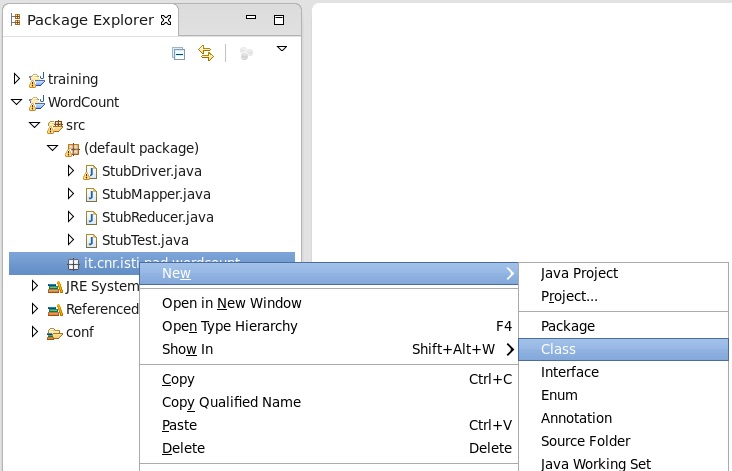
4. In the pop-up dialog, enter `WordCount` as the *Name*.
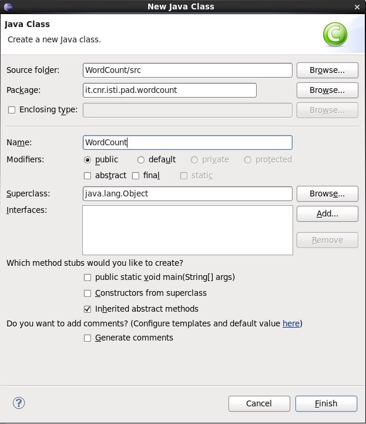
5. In the *Superclass* field, enter `Configured` and click the *Browse* button. From the popup window select `Configured − org.apache.hadoop.conf` and click the *OK* button.
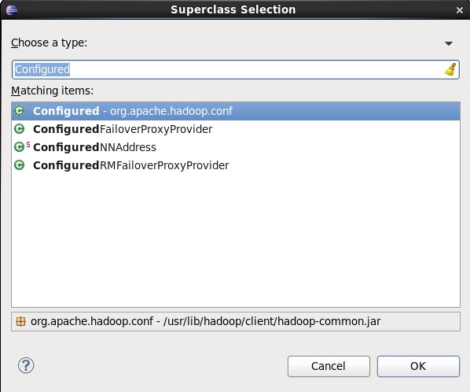
6. In the *Interfaces* section, click the *Add* button. In the field, enter `Tool` and select `Tool − org.apache.hadoop.util` and click the *OK* button.
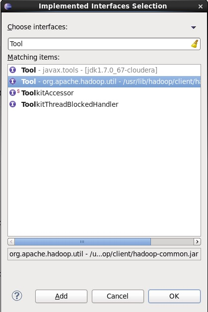
7. Check the boxes for `public static void main(String args[])` and *Inherited abstract methods* and click the *Finish* button.
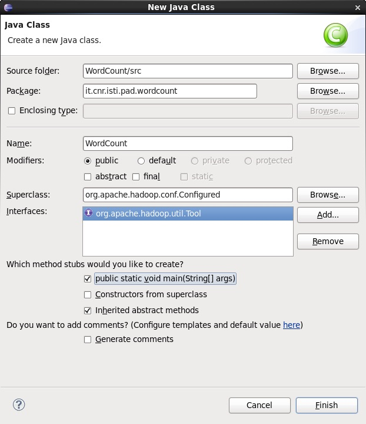
8. You will now have a rough skeleton of a Java file. You can now add code to this class to implement your Hadoop job. 
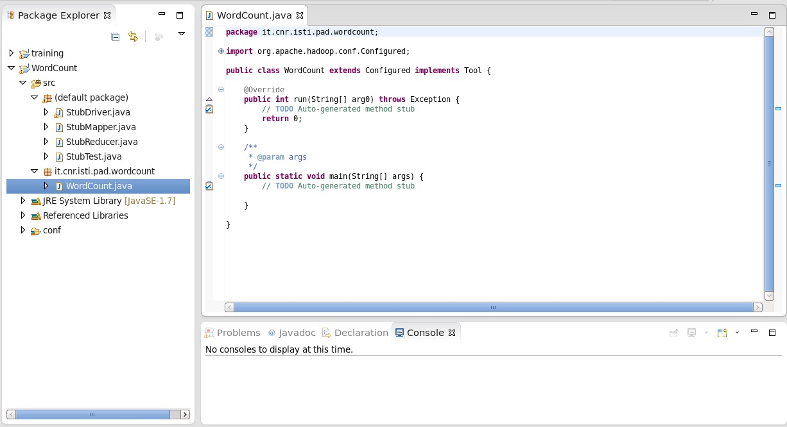
Rather than implement a job from scratch, copy the contents from [here](src/WordCount.java) and paste it into the `WordCount.java` file. The code in `WordCount.java` calculates the frequency of each word in a given dataset of text files.

## How to execute a Hadoop program

1. Copy/download the [pg100.txt](../data/pg100.txt) file in the `~/workspace/WordCount` directory. For example, open a *Terminal* window and run the following commands:

        cd ~/workspace/WordCount
        curl http://www.gutenberg.org/cache/epub/100/pg100.txt > pg100.txt
2. Right-click on the `WordCount` project node and select *Run As* → *Run Configurations*.
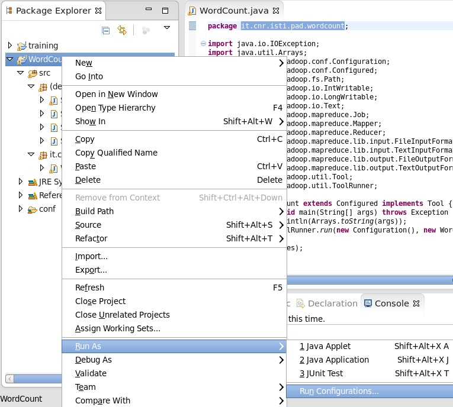
3. In the pop-up dialog, select the *Java Application* node and click the *New launch configuration* button in the upper left corner.
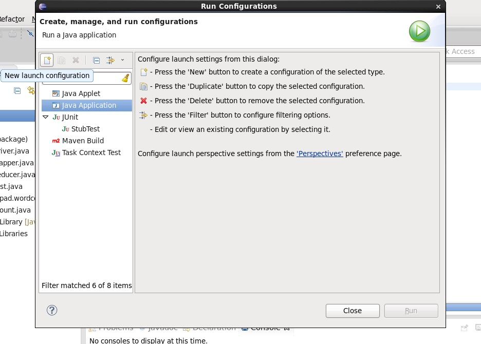
4. Enter a name in the *Name* field and `it.cnr.isti.pad.WordCount` in the *Main class* field.
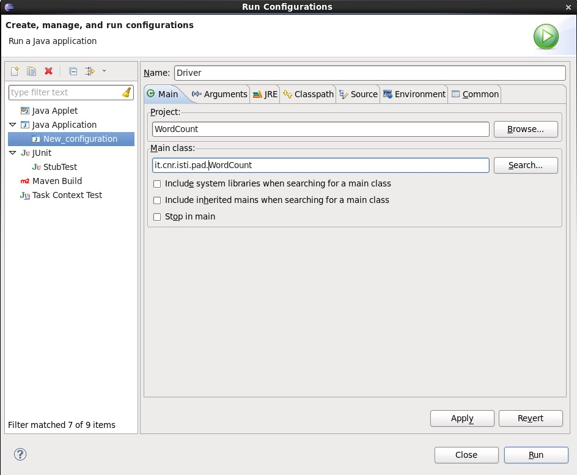
5. Switch to the *Arguments* tab and put `pg100.txt output` in the *Program arguments*. Click *Apply* and *Close*.
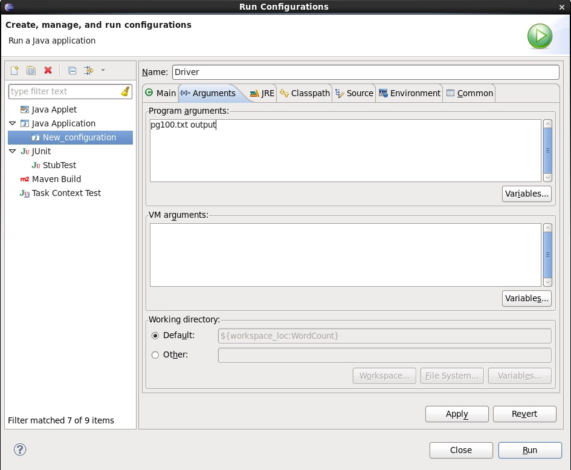
6. Right-click on the `WordCount` project nod and select *Run As* → *Java Application*.
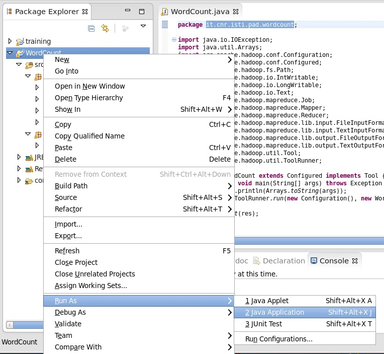
7. In the pop-up dialog select `WordCount - it.cnr.isti.pad.wordcount` from the selection list and click *OK*.
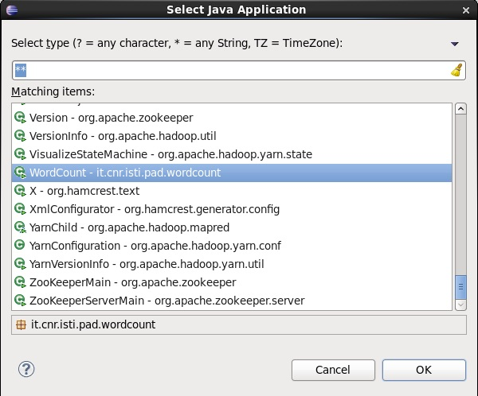
You will see the command output in the console window, and if the job succeeds, you’ll find the results in the `~/workspace/WordCount/output` directory. If the job fails complaining that it cannot find the input file, make sure that the `pg100.txt` file is located in the `~/workspace/WordCount` directory. If the job fails complaining that the `output` directory already exists, make sure to delete it. If the job fails raising a `java.lang.ArrayIndexOutOfBoundsException` exception, make sure that you correcly set the program arguments as in Step 5.

## How to package a Hadoop program in a JAR file

1. Right-click on the `WordCount` project node and select *Export*.
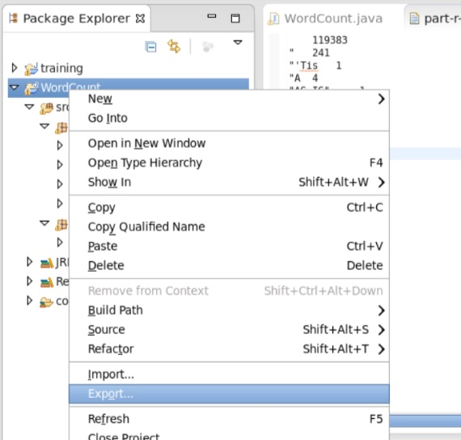
2. In the pop-up dialog, expand the *Java* node and select *JAR file*. Click *Next >*. 
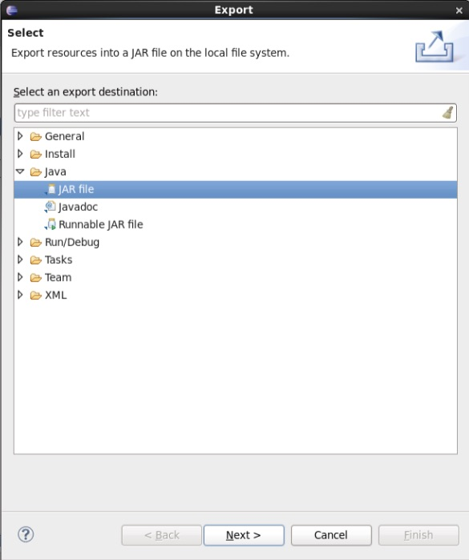
3. Enter `/home/cloudera/wordcount.jar` in the *JAR file* field and click *Finish*.
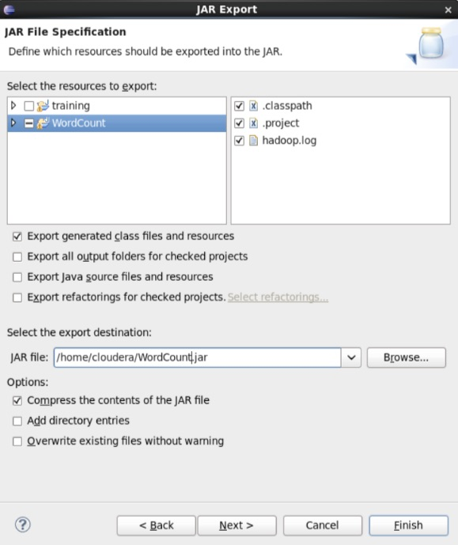
If you see an error dialog warning that the project compiled with warnings, you can simply click *OK*.

## How to execute a Hadoop programs from Terminal

1. Open a terminal and run the following commands:

        hadoop fs -put workspace/WordCount/pg100.txt
        hadoop jar wordcount.jar it.cnr.isti.pad. wordcount.WordCount pg100.txt output
2. Run the following command: 

        hadoop fs -ls output
You should see an output file for each reducer. Since there was only one reducer for this job, you should only see one `part-*` file. Note that sometimes the files will be called `part-NNNNN`, and sometimes they’ll be called `part-r-NNNNN`.

    
    
3. Run the following command: 

        bin/hadoop fs -cat output/part* | head
You should see the same output as when you ran the job locally. 

